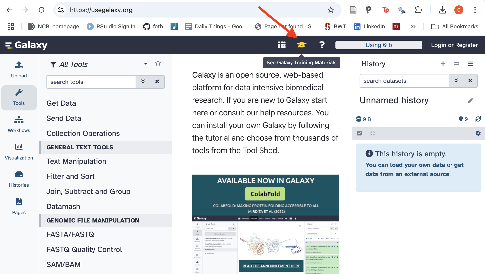

Learners can access training resources by registering and logging in to
a UseGalaxy.org account, then following this link:
https://usegalaxy.org/join-training/itn-at-moffitt-2025/ 

Note: this link will only be active for a week, but you can continue to use Galaxy resources for free!

    

