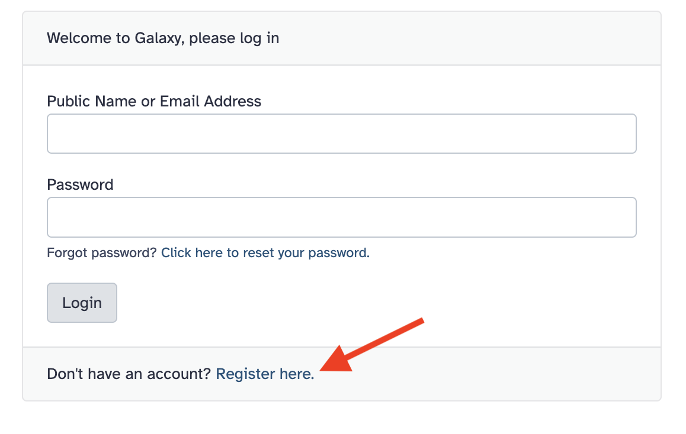
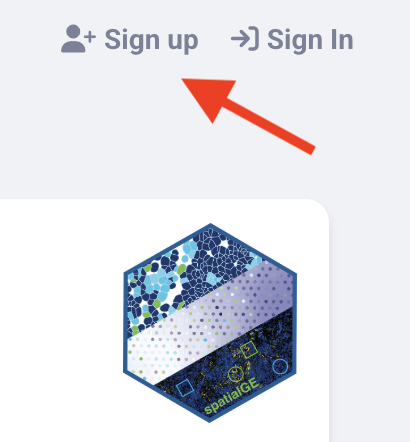

# Moffitt ITN Workshops

Welcome to the ITN Moffitt Workshop Series!

Over the next two days we will cover the a variety of bioinformatics topics. Please feel free to refer to these materials in the future. 

**Wifi:** Moffitt-Guest

### **Schedule**

| Day 1 (SRB Ferman Family Conference Room) - February 5: | Time                |  
|---------------------------------------------------------|:-------------------:|
| Computing and Data Ethics for Cancer Informatics        | 9:30 AM - 11:00 AM  |  
| Tools for Genomics and Single-Cell RNA-seq              | 11:00 AM - 12:30 PM |  
|  <mark>Free Lunch!    </mark>                             | 12:30 PM - 1:30 PM  |  
| Tools for Spatial Transcriptomics                       | 1:30 PM - 3:00 PM   | 

| Day 2 (SRB David Murphey Conference Room) - February 6: |  Time                   |
|---------------------------------------------------------|:-------------------:|
| Tools for Single-Cell Protein Imaging                   | 9:30 AM -11:00 AM   |  
| Transforming the Machine Learning Workbench with Galaxy | 11:00AM - 12:30 PM  |  

 

### **Pre-requisites**

This information was emailed to you, but you will need to register for the following resources based on the workshops you will be attending:

|         Workshop        | Galaxy | spatialGE | Posit Cloud |
|----------------------------|:------:|:------:|:-------:|
|Computing and Data Ethics for Cancer Informatics        |      |           |             |
|Tools for Genomics and Single-Cell RNA-seq              |       |           |             |
|Tools for Spatial Transcriptomics                       |        |           |             |
|Tools for Single-Cell Protein Imaging                   |        |           |             |
|Transforming the Machine Learning Workbench with Galaxy |        |            |            |

 

To create a **Galaxy** account, go to the [Galaxy login page](https://usegalaxy.org/login/start?redirect=None) and click the "Don't have an account? Register here." link at the bottom.

    

To create a **spatialGE** account, go to [spatialGE Website](https://spatialge.moffitt.org) and click on "Sign Up" in the upper right corner.

    

To create a **Posit Cloud** account, go to the [Posit Cloud website](https://login.posit.cloud/register?redirect=https%3A%2F%2Fclient.login.posit.cloud%2Foauth%2Flogin%3Fshow_auth%3D0%26show_login%3D0) and sign up with any of the shown methods.
