We will be working through a modified/truncated version of the [Galaxy Training Tutorial "Filter, plot, and explore single cell RNA-seq data with Seurat" Tutorial ](https://training.galaxyproject.org/training-material/topics/single-cell/tutorials/scrna-case_FilterPlotandExplore_SeuratTools/tutorial.html).

Changes include:

  - several subsections within QC will be omitted
  - we rearranged the Dimensionality Reduction section
  - we will stop before the Differential Expression Testing: Finding Markers section

:::{.warning}
You may want to view the whole Galaxy Training Tutorial later for further steps or explanation, but we would recommend not following along with it during this activity considering that we have abbreviated and rearranged a portion of it.
:::

## Setting up Galaxy 

### Open Galaxy

<input type="checkbox"> Please [use this link to access the Galaxy platform specifically for our activity](https://usegalaxy.org/join-training/itn-at-moffitt-2025/). 

Note: this link will only be active for this workshop, but you can continue to use Galaxy resources for free by visiting [usegalaxy.org](https://usegalaxy.org/).

### Set up Galaxy's history pane

<input type="checkbox"> If you have files in your history already, use the `+` button on the top right of the history pane to `Create new history`.  
<input type="checkbox"> Click the pencil button next to "Unnamed history". Fill in the name with something descriptive/appropriate. Click "Save".

    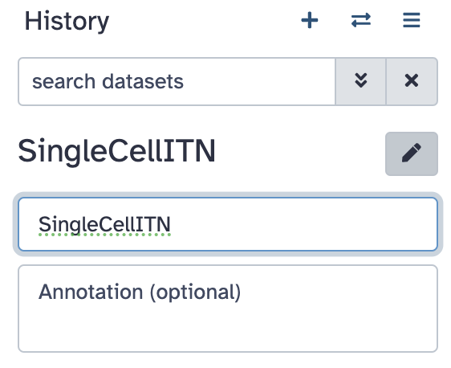

Now we are ready to start the tutorial!

## Get Data onto Galaxy and generate a Seurat object

<input type="checkbox"> Click on the "Get Data onto Galaxy and generate a Seurat object" link to get started in the tutorial.

### EBI Data Retrieval

<input type="checkbox"> Copy and paste  `EBI SCXA Data Retrieval` into the tool search.

    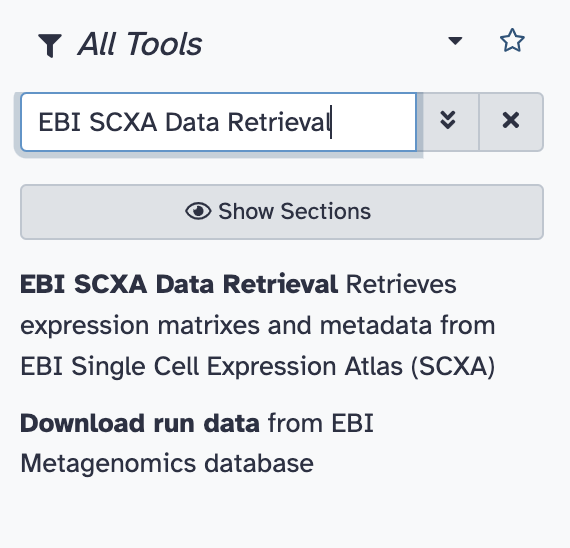

<input type="checkbox"> Select `EBI SCXA DATa Retrieval`.

<input type="checkbox"> Copy paste `E-MTAB-6945` into the `SC-Atlas experiment accession` field

<input type="checkbox"> Make sure the `“Choose the type of matrix to download”` field says `Raw filtered counts`.

<input type="checkbox"> Click the Run tool button.

    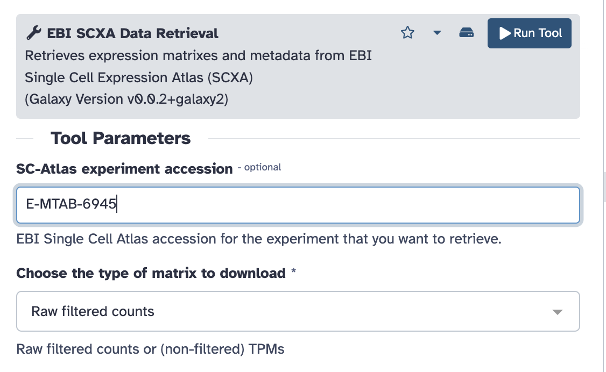

You will see your history pane show some new activity, with rectangles showing the data file upload first in gray (to show that the job has been requested), then yellow (to show that Galaxy is working on it), and finally green (to show that the job is complete).

Note: do not worry about the numbers next to each step - depending on how many times you run requests you will have different numbers.

    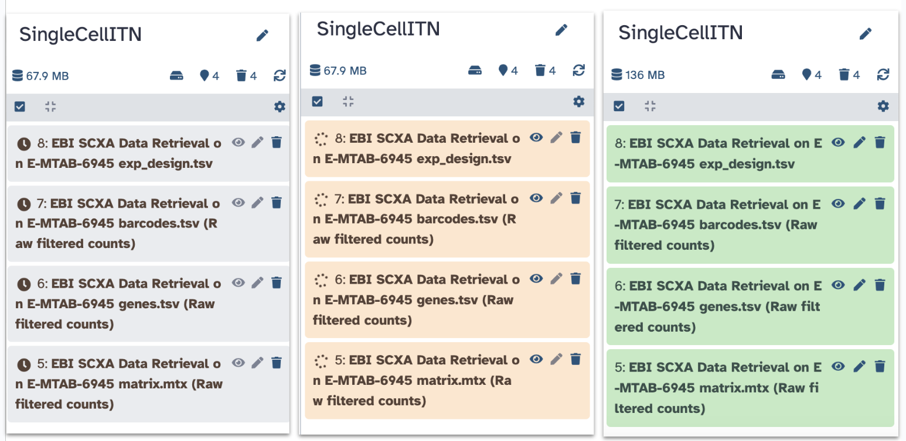

You have now imported the `exp_design.tsv`, `barcodes.tsv`, `genes.tsv`, `matrix.mtx` and files into Galaxy! Note that each file starts with `EBI SCXA Data Retrieval on E-MTAB-6945` to indicate how we got them.

### Generating a Seurat Read10X Object

Now we need to get our data into a format that the Seurat tools will recognize.

<input type="checkbox"> Copy paste `Seurat Read10x` into the tools search.

    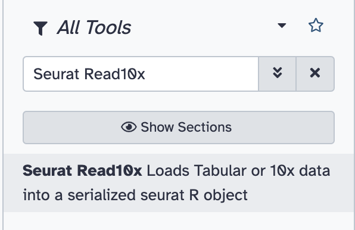

<input type="checkbox"> Select `Seurat Read10x`.

<input type="checkbox"> Select the pull down menu for the `Expression matrix in sparse matrix format (.mtx)` and select the `matrix.mtx` file.

    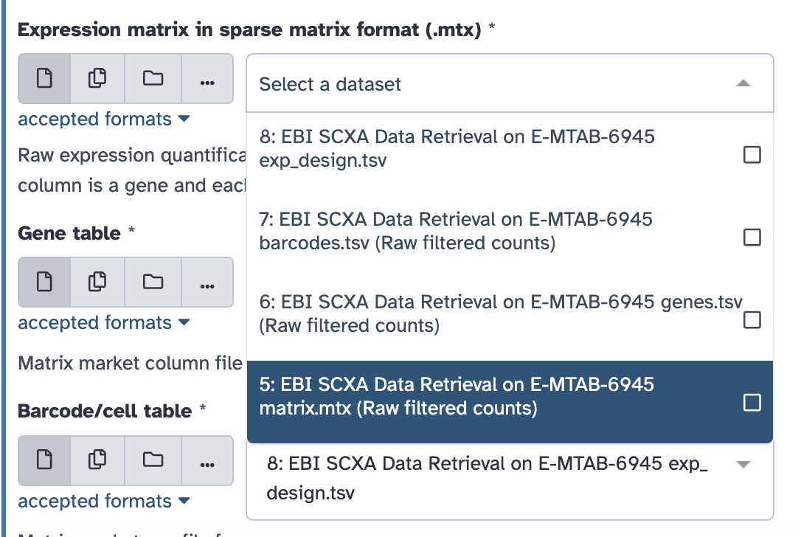

Continue with the rest of the files to select the appropriate file for each field. Remember that each file starts with `EBI SCXA Data Retrieval on E-MTAB-6945`.

<input type="checkbox"> Select the pull down menu for the `Gene table` and select the `genes.tsv` file.

<input type="checkbox"> Select the pull down menu for the `Barcode/cell table` and select the `barcodes.tsv` file.

<input type="checkbox"> Select the pull down menu for the `Cell Metadata` and select the `exp_design.tsv` file.

<input type="checkbox"> Type `5` into the `Minimum cells to include features`.

<input type="checkbox"> Ensure that the `Choose format of the output` field says `RDS with a Seurat object`.

<input type="checkbox"> Rename the output to `Initial Seurat Object`.

    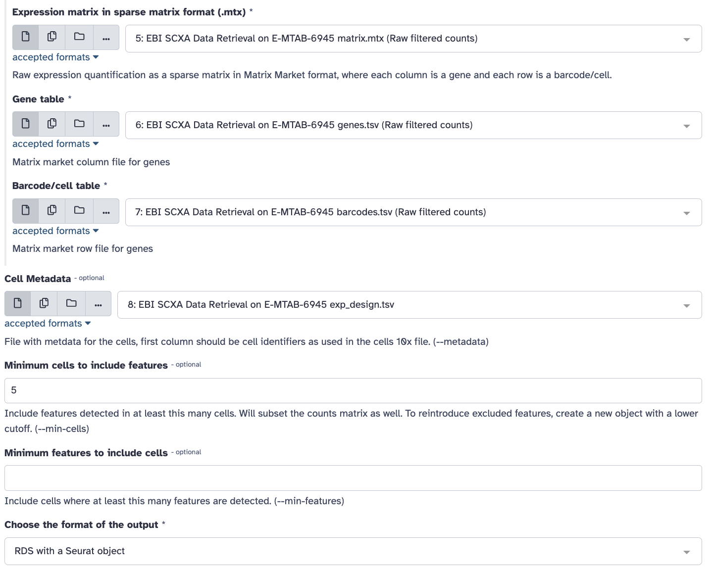

<input type="checkbox"> Click `Run Tool` Button.

You should see a green message indicating that the job is now in the queue.

<input type="checkbox"> Click on the pencil button of the new output that shows up in the history pane.

    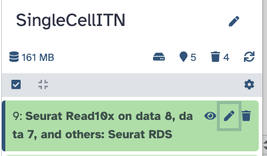

<input type="checkbox"> Replace the name of the object to `Initial Seurat Object` and press save.

    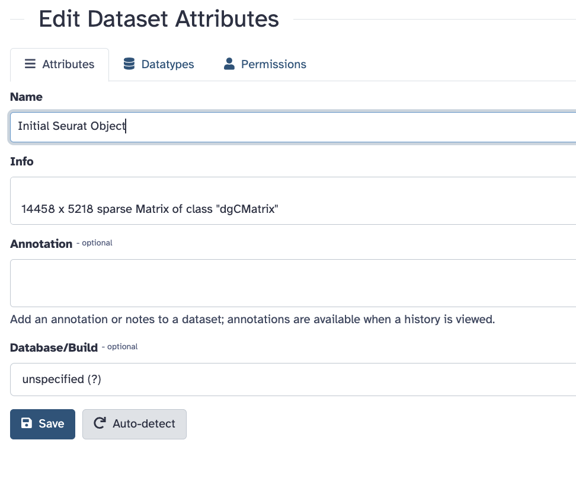

Now we have a Seurat object so we can start using Seurat to work with our data!

## QC and further processing of the Seurat object

Our first step is to do some Quality Control checks aka QC to evaluate our data.

### QC: Visualize Counts

There will be a number of "cells" that are actually just empty droplets or low-quality. There will also be genes that could be sequencing artifacts or that appear with such low frequency that statistical tools will fail to accurately analyze them.

This background noise of both cells and genes not only makes it harder to distinguish real biological information from artifacts, but also makes it computationally demanding to analyze.

We want to filter our cells, but first we need to know what our data looks like to make appropriate filters.

We will not have time to go through all of the possible plots one might use, but we will do some evaluations. Remember that you can always do the full tutorial in your own time.

<input type="checkbox"> Search for the `Plot with Seurat` tool in the tool search.

<input type="checkbox"> Select `**Plot** with Seurat`.

    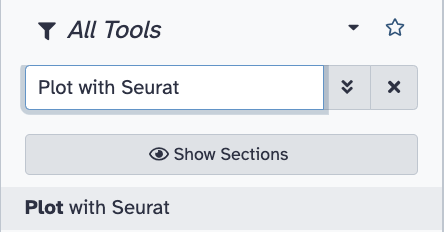

<input type="checkbox"> Ensure that the RDS file field shows our Initial Seurat Object.

<input type="checkbox"> For the `Plot_type_selector` dropdown menu, select `VlnPlot`.

This stands for violin plot.

<input type="checkbox"> For the `Features` field type in `nCount_RNA`.

<input type="checkbox"> Scroll down to `Log` and toggle it to yes.

<input type="checkbox"> Click the Run Tool button.

You should see a green message about the job being in the queue and a new block will show up in the history that says plot. It will take some time for the plot to be generated.  

<input type="checkbox"> Once the new block turns green click on the eye button to see the plot.

    

This plot shows us the spread of cells in our data containing a given number of counts (or transcripts) observed in a given cell. We can use this plot, and others like it in a moment, to help filter out the uninformative cells.

    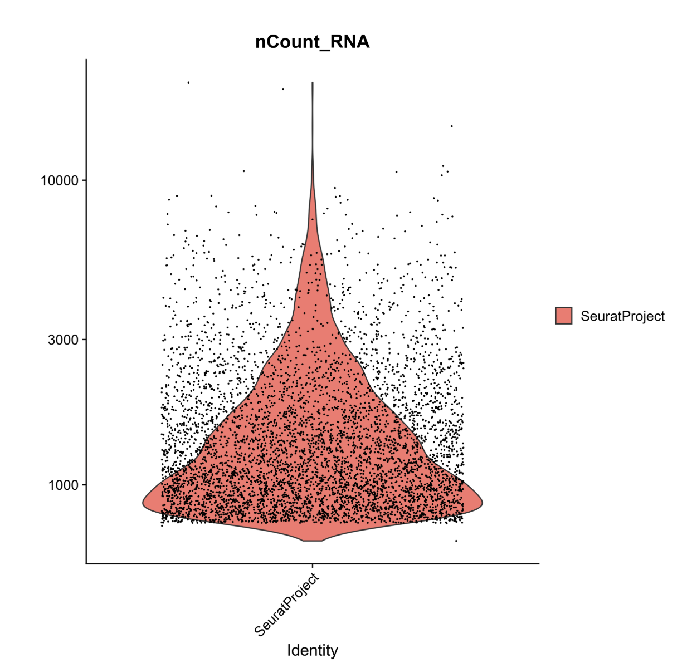

We see a severe drop off in the number of cells that contain fewer than 500 and more than 10,000 transcripts. These will be our nCount thresholds that we filter based on.

### QC: Visualize Features

In a similar fashion we can visualize the spread of cells in our data expressing a given number of features (or genes).

<input type="checkbox"> Search for the `Plot with Seurat` tool in the tool search again.

<input type="checkbox"> Select `**Plot** with Seurat`.

<input type="checkbox"> Ensure that the RDS file field shows our Initial Seurat Object.

<input type="checkbox"> For the `Plot_type_selector` dropdown menu, select `VlnPlot`.

<input type="checkbox"> For the `Features` field type in `nFeature_RNA`.

<input type="checkbox"> Scroll down to `Log` and toggle it to yes.

<input type="checkbox"> Click the Run Tool button.

Now, we could pick filtering thresholds based on these plots, and in a typical pipeline we would also plot the proportion of features that map to the mitochondrial genome and to other QC checks but we will stop here for now.

    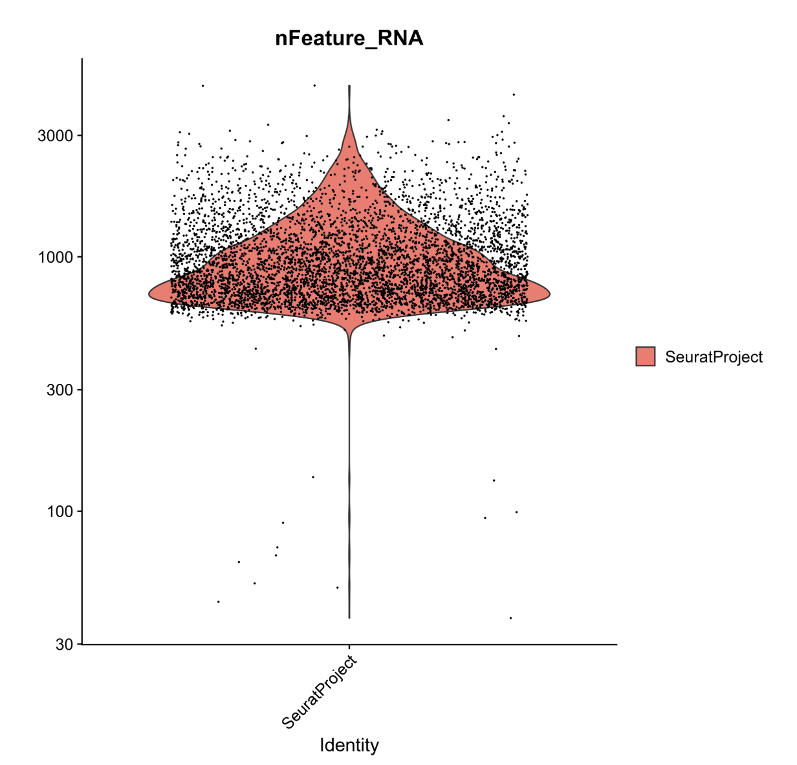

In this plot, we can see that very few cells in the dataset contain fewer than ~500 genes. Biologically, this makes sense, and the cells appear to be outliers in the data. As such, we will set our lower threshold of genes (nFeature_RNA) at 500.

### Filter Cells

Recall that from our first plot we saw a severe drop off in the number of cells that contain fewer than 500 and more than 10,000 transcripts. These will be our nCount thresholds that we filter based on. and that our lower threshold of genes would be 500 from our second plot.

Will will now apply these thresholds to filter our data.

<input type="checkbox"> Search for the `Seurat FilterCells` tool in the tool search.

<input type="checkbox"> Select `Seurat FilterCells`.

<input type="checkbox"> Ensure that the RDS file field shows our Initial Seurat Object.

<input type="checkbox">  In Subsets used to filter cells”, `Name of Parameter to filter on` field, select `nCount_RNA` from the dropdown menu.

<input type="checkbox"> Select 500.0 for the Minimum value.

<input type="checkbox"> Select 10000.0 for the Maximum value.

<input type="checkbox"> Click on the button that says `Insert Subsets used to filter cells`

    

<input type="checkbox"> For the `Name of Parameter to filter on` field, select `nFeature_RNA` from the dropdown menu.

<input type="checkbox"> Select 500.0 for the Minimum value.

<input type="checkbox"> Select 1000000000.0 for the Maximum value.

<input type="checkbox"> Click the Run Tool button.

You will see a green message a new block in the history that says "Seurat Filter cells on data", after a few moments it will turn green.

<input type="checkbox"> Rename the output object to be `Filtered Seurat Object` by clicking on the pencil button and replacing the name and saving the changes.

### Normalize Data

Now we will normalize our data. This helps reduce the differences between gene counts by fitting total counts across cells in our data to be comparable to one another. 

<input type="checkbox"> Search for the `Seurat NormaliseData` tool in the tool search.

<input type="checkbox"> Select `Seurat NormaliseData`.

<input type="checkbox"> Ensure that the RDS file field shows our *Filtered* Seurat Object.

<input type="checkbox"> For the `Normalization Method` ensure that the drop down menu shows `log Normalise`.

<input type="checkbox"> Click the Run Tool button.

<input type="checkbox"> Once the new SeuratNormalise Data object turns green in the history pane, rename it to be `Normalised Seurat Object` by clicking on the pencil button and replacing the name and saving the changes.

### Find Variable Genes

The datasets have loads of genes, but not all of them vary in expression from cell to cell. For instance, housekeeping genes are defined as not changing much from cell to cell, so a researcher could choose to remove these from the data to simplify their analysis. Here, we are just flagging genes that show variability in expression from cell to cell to use for dimensional reduction purposes later.

The find variable genes, this step flags genes that do vary across cells to expedite future analyses and ensure that we, and Seurat, don’t waste time looking for meaningful differences where they don’t exist.

<input type="checkbox"> Search for the `Seurat FindVariableGenes` tool in the tool search.

<input type="checkbox"> Select `Seurat FindVariableGenes`.

<input type="checkbox"> Ensure that the `RDS file` field shows our *Normalised* Seurat Object.

<input type="checkbox"> Ensure that the `Choose the format of the output` field shows RDS with a Seurat Object.

<input type="checkbox"> Click the Run Tool button.

This will result in the creation of two new objects:

1. A new Seurat object with variable features identified and flagged
2. A tabular file with a list of these variable genes.

This gene list may be used as a sneak peak into understanding what the dataset will look like! We can begin to understand which genes are going to be driving downstream clustering of our cells and maybe even make some decisions about whether we are happy with our filtering based on this list.

<input type="checkbox"> Rename the new Seurat object called `Seurat FindVariableGenes on Data some number:Seurat RDS` to be `Normalised Seurat Object with Variable Features` by clicking on the pencil button, replacing the name and clicking save.

### Scale Data

Now we will scale the data.

What is scaling?

This is an important step to set up our data for further dimensionality reduction. It will transform the dataset such that all genes have the same variance and a zero mean. It helps negate sequencing depth differences between samples, since the gene levels across the cells become comparable.

Note: that the differences from scaling etc. are not the values you have at the end - i.e. if your cell has average GAPDH levels, it will not appear as a "0" when you calculate gene differences between clusters.

<input type="checkbox"> Search for the `Seurat ScaleData` tool in the tool search.

<input type="checkbox"> Select `Seurat ScaleData`.

<input type="checkbox"> Ensure that the `RDS file` field shows our object called Normalised Seurat Object with Variable Features.

<input type="checkbox"> Ensure that the `Choose the format of the output` field shows RDS with a Seurat Object.

<input type="checkbox"> For the `Genes to use` dropdown menu select `Seurat FindVariableGenes on data 12: Variable genes **tabular file**`. This is the gene list we just made in the last step.

<input type="checkbox"> For `Vars to regress` ensure that it says `nCount_RNA`.

This function allow us to mitigate the effects of confounding factors in our dataset. In true research practice, one might regress out multiple variables including but not limited to percent mitochondria, cell cycle scoring, and feature count. As currently written, this tool only allows us to regress out a single variable.

<input type="checkbox"> For `Statistical Model` ensure that it says `Linear model`.

<input type="checkbox"> Click the Run Tool button.

This step can take a few moments.

<input type="checkbox"> Once the new object turns green, rename it to be `Scaled,Preprocessed Seurat Object` by clicking on the pencil button, replacing the name and clicking save.

Nice! We now have a preprocessed Seurat object!

## Dimensionality Reduction

Although we’ve made our expression values comparable to one another and our overall dataset less computationally demanding, we still have way too many dimensions (n cells x n genes!).

Transcript changes are not usually singular–which is to say, genes function and exist in pathways and groups. It would be easier to analyze our data if we could group these differences. To address this we will run principal component analysis (PCA).

### Run PCA

Principal components (PCs) are calculated from highly dimensional data to find the most representative spread in the dataset. So in our highly variable gene dimensions, there will be one line (axis) that yields the most spread and variation across the cells. That will be our first principal component.

We can calculate the first handful of principal components in our data to drastically reduce the number of dimensions.

<input type="checkbox"> Search for the `Seurat RunPCA` tool in the tool search.

<input type="checkbox"> Select `Seurat RunPCA`.

<input type="checkbox"> Ensure that the `RDS file` field shows our object called Scaled, Preprocessed Seurat Object.

<input type="checkbox"> Ensure that the `Choose the format of the output` field shows RDS with a Seurat Object.

<input type="checkbox"> For the dropdown menu in the `Genes to Scale` section, select the variable genes tabular file.

    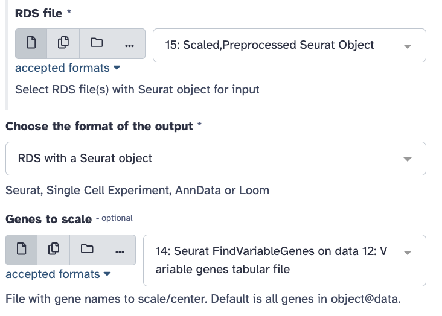

<input type="checkbox"> Click the Run Tool button.

You will see 4 new objects: `Seurat Std dev`, `Seurat Loadings`, `Seurat Embeddings`, and `Seurat RDS` (the object type we have mostly been using).

<input type="checkbox"> Once the new object turns green, rename the one that says `Seurat RDS` to be `PCA Processed Seurat Object` by clicking on the pencil button, replacing the name and clicking save.

So what are all these new objects?

- Seurat RDS - includes all of the following PCA metadata
- Seurat Embeddings - Principal component values for each of the cells in your dataset
- Seurat Loadings -  Principal component values for each of the genes in your dataset
- Seurat Std dev - Standard deviations of each principal component coordinates

### Run UMAP

Next we will use UMAP, the most recently developed, and most widely used dimensionality reduction method for visualization of principal component data. It has been optimized since tSNE to better preserve global structure and is less computationally demanding.

Note that this is where the walkthrough diverges from the Galaxy Training tutorial, rearranging the dimensionality reduction steps.

<input type="checkbox"> Search for the `Seurat UMAP` tool in the tool search.

<input type="checkbox"> Select `Seurat UMAP`.

<input type="checkbox"> Ensure that the `RDS file` field shows our object called PCA Processed Seurat Object.

<input type="checkbox"> Ensure that the `Choose the format of the output` field shows RDS with a Seurat Object.

<input type="checkbox"> For the `Dims` type `1:15`.

<input type="checkbox"> Click the Run Tool button.

### Plot Gapdh

<input type="checkbox"> Search for the `Plot with Seurat` tool in the tool search.

<input type="checkbox"> Select `Plot with Seurat`.

<input type="checkbox"> Ensure that the `RDS file` field shows "Seurat UMAP on data X: Seurat RDS" as the input for this step (this file is the output from the previous step).

<input type="checkbox"> Confirm that the `Plot_type_selector` option is "FeaturePlot".

<input type="checkbox"> For the `Features` option, type `Gapdh`.

<input type="checkbox"> Click the Run Tool button.

<input type="checkbox"> View the resulting plot by clicking the eye icon ({#id .class width=25 height=20px}) next to the output `.png` file in the history.

### Plot Il2ra

<input type="checkbox"> Search for the `Plot with Seurat` tool in the tool search.

<input type="checkbox"> Select `Plot with Seurat`.

<input type="checkbox"> Ensure that the `RDS file` field shows "Seurat UMAP on data X: Seurat RDS" as the input for this step (this file is the output from the Run UMAP step).

<input type="checkbox"> Confirm that the `Plot_type_selector` option is "FeaturePlot".

<input type="checkbox"> For the `Features` option, type `Il2ra`.

<input type="checkbox"> Click the Run Tool button.

<input type="checkbox"> View the resulting plot by clicking the eye icon ({#id .class width=25 height=20px}) next to the output `.png` file in the history.

Can I plot UMAP clusters at this stage?

If you wanted to plot a UMAP projection at this stage using the `Plot with Seurat` tool and `Plot_type_selector` `DimPlot` option (as described in the Galaxy Training tutorial), do not use "Group by: RNA_nn_res.0.5" argument. Because the Find Neighbors and Find Clusters steps haven't been used yet, this option isn't relevant yet, and you won't be able to visualize clusters.

## Cell Clustering

### Find Neighbors

<input type="checkbox"> Search for the `Seurat FindNeighbours` tool in the tool search.

<input type="checkbox"> Ensure that the `RDS file` field shows "Seurat UMAP on data X: Seurat RDS" as the input for this step (this file is the output from the Run UMAP step).

<input type="checkbox"> For the `Reduction` option, type `pca`.

<input type="checkbox"> For the `Dimensions` option, copy and paste `1,2,3,4,5,6,7,8,9,10,11,12,13,14,15`.

<input type="checkbox"> For the `Assay` option, type `RNA`.

<input type="checkbox"> Click the Run Tool button.

The output of this will be
"Seurat FindNeighbours on data Y: Seurat RDS" (and a corresponding CSV file)

### Find Clusters

<input type="checkbox"> Search for the `Seurat FindClusters` tool in the tool search.

<input type="checkbox"> Ensure that the `RDS file` field shows "Seurat FindNeighbours on data Y: Seurat RDS" as the input for this step.

<input type="checkbox"> In the `Advanced Options` section, for the `Resolution` option, type `0.5`

<input type="checkbox"> Click the Run Tool button.

The output of this will be "Seurat FindClusters on data Z: Seurat RDS" (and a corresponding CSV file)

### Plot UMAP (with clusters)

<input type="checkbox"> Search for the `Plot with Seurat` tool in the tool search.

<input type="checkbox"> Ensure that the `RDS file` field shows "Seurat FindClusters on data Z: Seurat RDS" as the input for this step.

<input type="checkbox"> Select "DimPlot" for the `Plot_type_selector` option.

<input type="checkbox"> For the `Group by` option, type `RNA_nn_res.0.5`

<input type="checkbox"> Click the Run Tool button.

<input type="checkbox"> View the resulting plot by clicking the eye icon ({#id .class width=25 height=20px}) next to the output `.png` file in the history.

## Other Resources

- [Further information on Seurat and its manual](https://satijalab.org/seurat/)

- [UMAP discussion](https://alleninstitute.org/resource/what-is-a-umap/)
