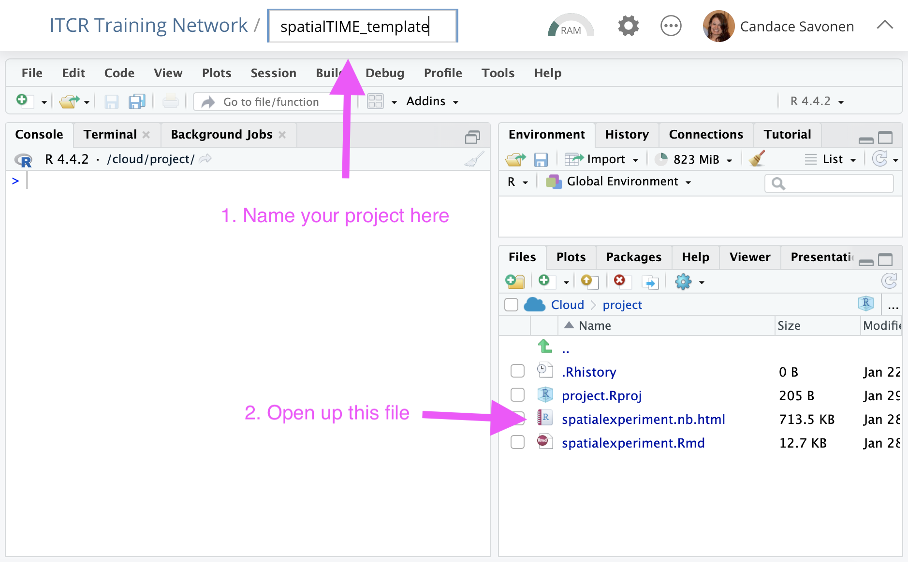
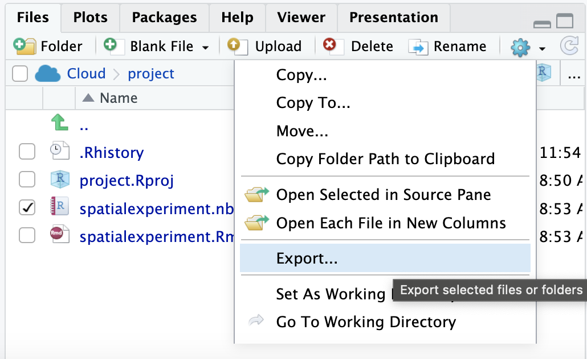

```{r echo = FALSE, show = FALSE}
knitr::opts_chunk$set(number_sections = FALSE)
```
## Activity: Set Up Posit Cloud

For easy start up we will use Posit Cloud -- an online resource for using R.

<input type="checkbox"> If you have not already, accept the invite to our Posit cloud space that was sent to your email (that you registered for this workshop with). <br>  

The email will looks like this: 
> 
______ has invited you to join Posit Cloud. By clicking on the link below, you can join the space that has been shared with you. Note that you will first be prompted to create an Posit Cloud account.<br> 

<input type="checkbox"> Create an account if needed. <br>  
<input type="checkbox"> Log into Posit.Cloud if needed <br>
<input type="checkbox"> Get a copy of this workspace https://posit.cloud/spaces/604196/content/9588231 You can also find it in the "Workshops" list <br>
<input type="checkbox"> Name your copy of your workspace by typing in on the title at the top.  <br>



<input type="checkbox">  On one of the early steps in the code it will ask you `.cache/R/ExperimentHub does not exist, creat directory? (yes/no)`. Type in "yes" and hit Enter. You should only have to do this once. <br>

<input type="checkbox"> Now follow along with each step in the notebook and clicking the green triangles at each code chunk as we move along.

**It is very important you run each step in order for the code to work!**

<input type="checkbox"> For this notebook, as you save the Rmd, the output is saved as a snapshot in the nb.html file. Click on this nb.html file and choose "View in web browser" <br>

## Bonus: To run on your own computer

We will keep the Posit Cloud account available to you for one week after the workshop. Please download your files you'd like to keep before this week is up!

If you'd like to run this on your own computer

<input type="checkbox"> Download the Rmd by clicking the checkmark next to the Rmd file name. <br>
<input type="checkbox"> Then click on the gear and choose "Export". <br>



<input type="checkbox"> You will need to [install Rstudio](https://posit.co/download/rstudio-desktop/).

<input type="checkbox"> If you are new to Rstudio [we recommend this resource](https://hutchdatascience.org/Tools_for_Reproducible_Workflows_in_R/a-tour-of-rstudio.html). <br>
<input type="checkbox">

### For more learning:

- [Statistical analysis of spatial single-cell protein data](http://juliawrobel.com/PSB_scProteomics/)
- [VectraPolarisData Bioconductor package](https://www.bioconductor.org/packages/release/data/experiment/vignettes/VectraPolarisData/inst/doc/VectraPolarisData.html)
- [A short course on multiplex single-cell imaging in R](http://juliawrobel.com/MI_tutorial/)
